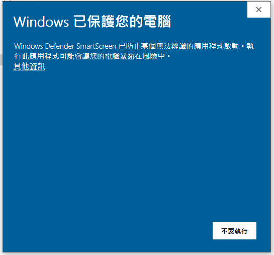
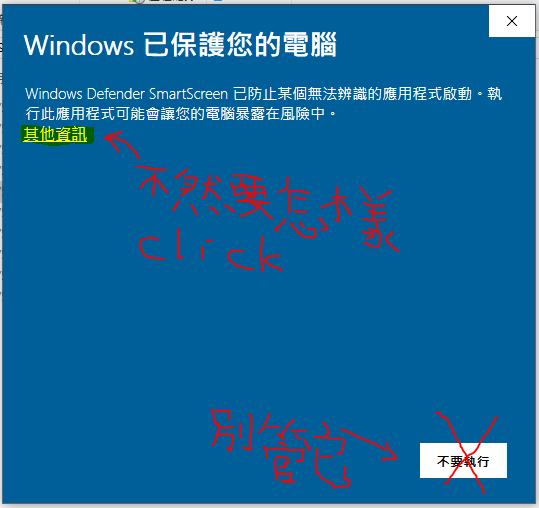
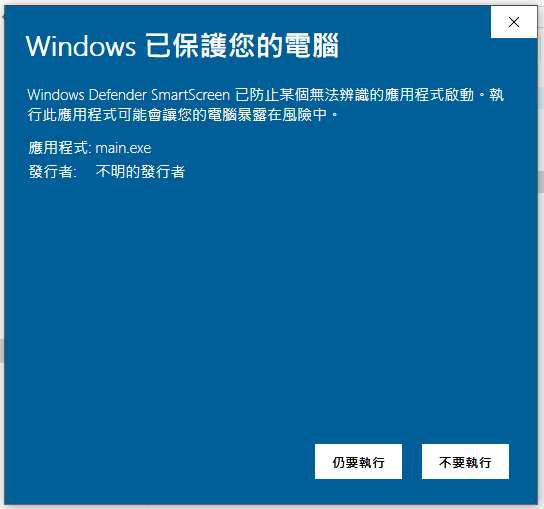

                  
小叮嚀: 以下步驟僅供參考              
*安裝概要 Windows OS*          
### Spyder安裝要素
>1.要是3.x版
>
>2.安裝選擇for everyone

*在開始之前: 先下載 Anaconda 吧!*             
https://www.anaconda.com/download/        
推薦下載 Python 3.x.x 版，安裝時請點擊 Next> 最後請務必安裝VS CODE                      
安裝過程請參考https://codingonmac.blogspot.com/2017/08/windows-10-64bitsspyder-anaconda.html                      

Step 1.設定環境變數(控制台–>系統及安全性–>系統–>進階系統設定–>環境變數) 新增PATH且值為Python.exe的路徑如C:\ProgramData\Anaconda3                        如有其他值已存在，請先加上';'再輸入其值!                

Step 2.下載本zip檔要先解壓縮 建議解壓縮到C:槽      

       2-1以系統管理員的身分執行main.exe                              
       *2019補充更新
              安全性防護之處理措施:*                               

       2-2.搜尋程式與功能 or 搜尋 Windows –> 輸入cmd並按滑鼠右鍵選擇(以系統管理員的身分執行)               
           根據Win版本不同而不同!        

Step 4.根據畫面提示輸入直到要求按下ENTER時就好了!           
       最後啟動Spyder–>Tools–>Perferences–>Advanced Setting–>Language–>繁體中文                         
特別感謝https://poedit.net & https://txtconv.arpuli.com/                                  
尊重隱私~請勿任意轉載謝謝配合!!
