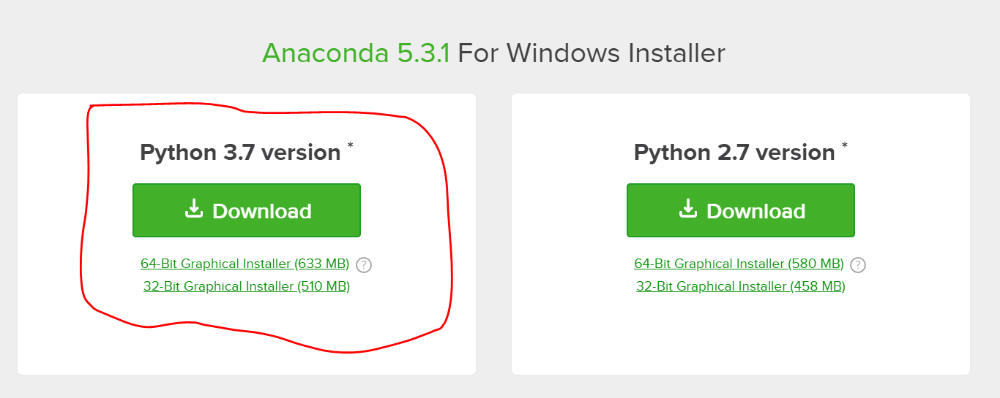
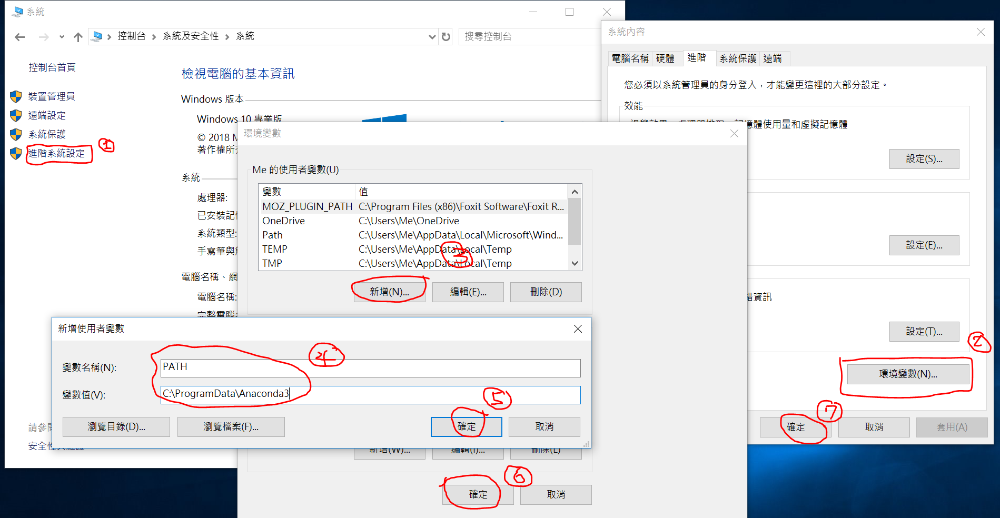
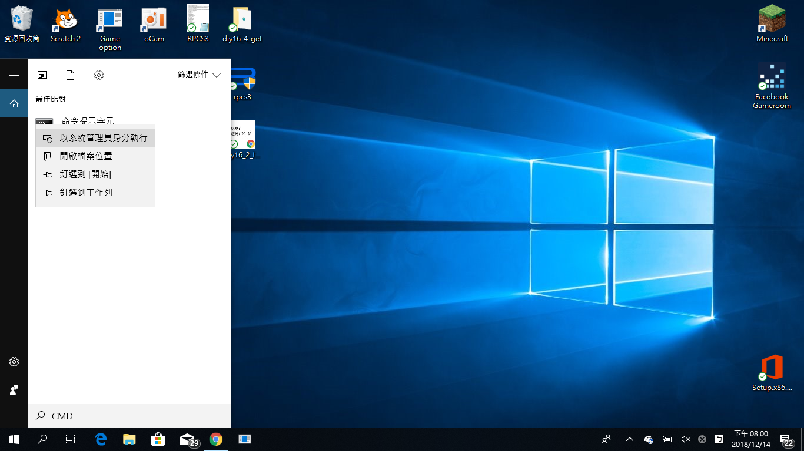
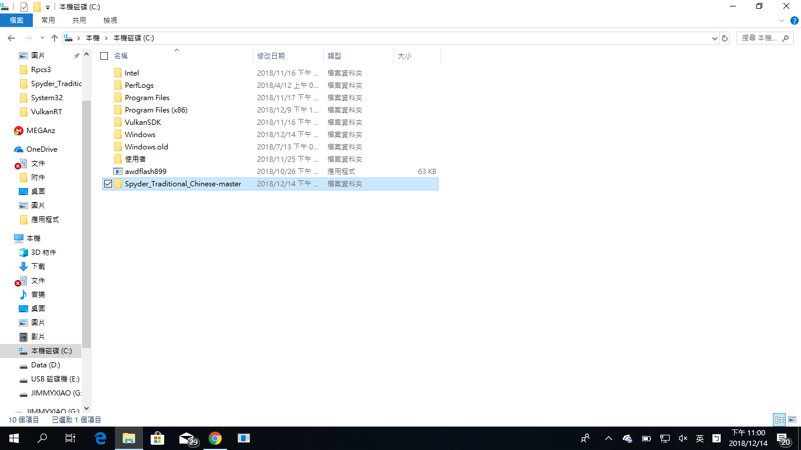
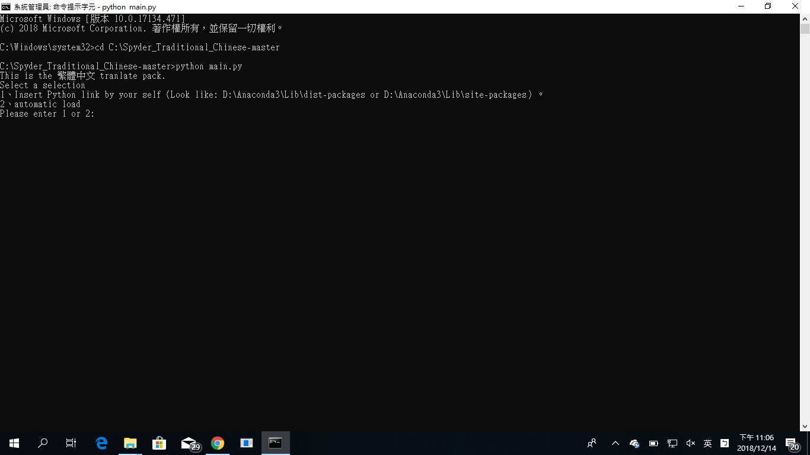
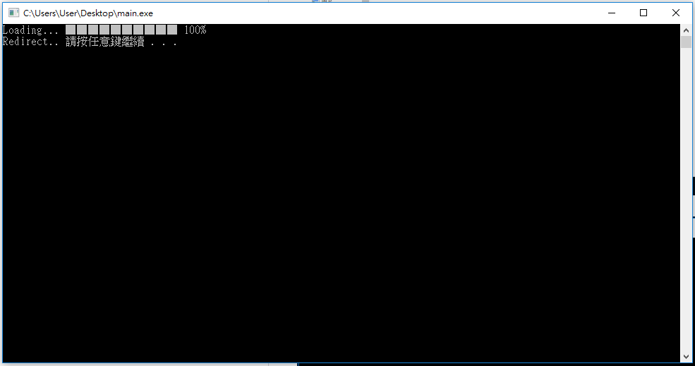
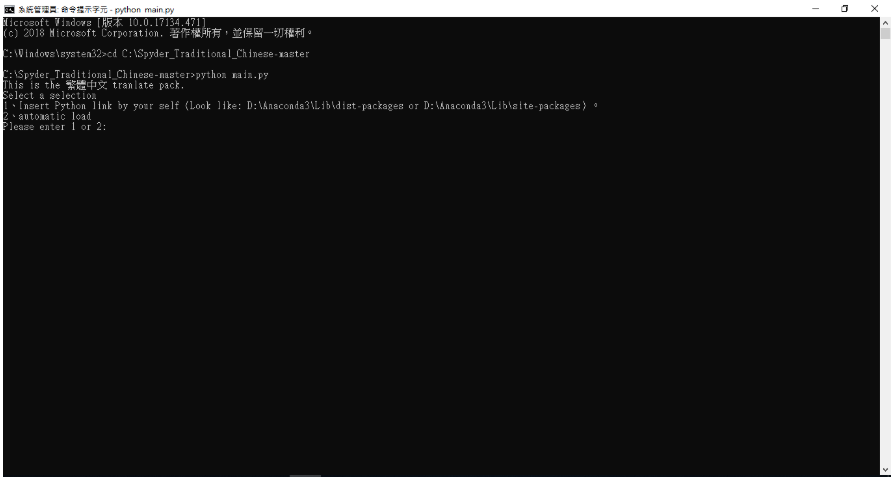

                  
小叮嚀: 以下步驟僅供參考，切勿點擊圖片(不會有任何反應...)          
在開始之前: 先下載 Anaconda 吧!             
https://www.anaconda.com/download/        
推薦下載 Python 3.x.x 版，安裝時請點擊 Next> 最後請務必安裝VS CODE                      

Step 1.設定環境變數(控制台–>系統及安全性–>系統–>進階系統設定–>環境變數) 新增PATH且值為Python.exe的路徑如C:\ProgramData\Anaconda3                        如有其他值已存在，請先加上';'再輸入其值!                

Step 2.搜尋程式與功能 or 搜尋 Windows –> 輸入cmd並按滑鼠右鍵選擇(以系統管理員的身分執行)               
       根據Win版本不同而不同!        

Step 3.下載本zip檔要先解壓縮 建議解壓縮到C:槽      

       以系統管理員的身分執行main.exe                              

Step 4.根據畫面提示輸入直到要求按下ENTER時就好了!           
       最後啟動Spyder–>Tools–>Perferences–>Advanced Setting–>Language–>繁體中文          
也可以為這個世界盡一份心力好比翻譯成其他語言等                   
原始檔請勿轉傳，或註明來源by shou692199，修改請上傳至shou692199@gmail.com                        
謝謝配合!!
